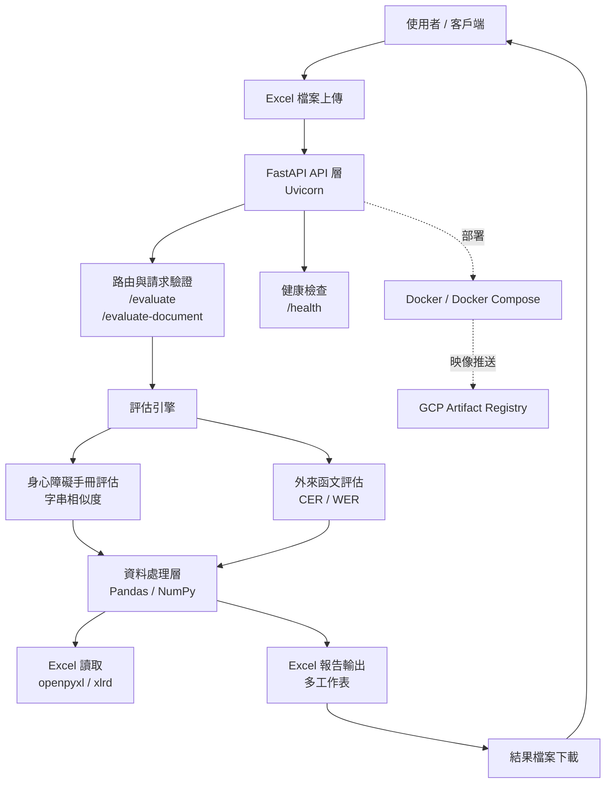

# AI Document Accuracy Evaluator API

AI文件辨識準確度評分系統 - FastAPI版本

## 概述

這是一個基於FastAPI的Web API，用於評估AI文件辨識結果的準確度。系統支援兩種評估模式：
1. **身心障礙手冊評估** - 評估身心障礙手冊AI測試結果的準確度
2. **外來函文評估** - 評估外來函文OCR辨識結果的準確度（支援多模型對比）

系統接受Excel檔案上傳，分析AI預測結果與正確答案的相似度，並生成詳細的評估報告。

## 功能特色

### 身心障礙手冊評估
- **檔案上傳**: 支援.xlsx和.xls格式的Excel檔案
- **準確度評估**: 計算各欄位和整體的準確度分數
- **詳細分析**: 提供逐筆記錄的欄位比較
- **錯誤分析**: 識別和分類不同類型的錯誤

### 外來函文評估（新功能）
- **多模型支援**: 支援水平格式的多模型對比評估
- **OCR準確度評估**: 使用CER（字符錯誤率）和WER（詞錯誤率）評估
- **模型分頁輸出**: 每個模型生成獨立的評估工作表
- **valueSetId支援**: 支援指定資料集標識符

### 通用功能
- **Excel輸出**: 生成包含評估結果的Excel報告
- **RESTful API**: 標準的HTTP API介面
- **Docker部署**: 支援容器化部署
- **健康檢查**: 提供服務健康狀態監控

## 技術架構

### 系統架構圖



### 文字說明

1. **入口層（API）**：使用者上傳 Excel 檔案到 FastAPI，系統依端點分流到身心障礙手冊評估或外來函文評估流程。  
2. **評估層（Engine）**：身心障礙手冊流程以字串相似度計算欄位準確度；外來函文流程以 CER/WER 計算 OCR 準確度，並支援多模型比較。  
3. **資料處理層（Data Processing）**：由 Pandas/NumPy 統一完成資料清理、欄位比對、統計計算與結果彙整。  
4. **檔案處理層（Excel I/O）**：透過 openpyxl/xlrd 讀取來源檔，並輸出包含摘要、明細與分析工作表的 Excel 報告供下載。  
5. **維運與部署層**：API 可透過 Docker/Docker Compose 容器化執行，並可將映像推送至 GCP Artifact Registry 供後續部署。  

### 技術架構詳細說明

#### 1. 介面與接入層（Client / API Entry）
- **組成**：前端頁面、curl、Python requests 或其他 HTTP 客戶端。
- **主要工作**：
  - 以 multipart/form-data 上傳 Excel 檔案。
  - 呼叫對應端點啟動評估流程：
    - `POST /evaluate`：身心障礙手冊評估
    - `POST /evaluate-document`：外來函文評估（可帶 `valueSetId`）
  - 接收回傳的 Excel 結果檔並下載保存。
- **責任邊界**：僅負責發送請求與接收結果，不執行核心評估邏輯。

#### 2. API 路由與請求驗證層（FastAPI Router Layer）
- **組成**：FastAPI 路由、請求解析、參數驗證、錯誤回應格式。
- **主要工作**：
  - 解析上傳檔案與表單參數。
  - 驗證檔案格式、檔案大小、空檔案等條件。
  - 依 API 端點將請求分派到對應評估服務。
  - 統一例外處理，回傳標準化錯誤訊息（400/422/500）。
- **責任邊界**：處理 HTTP 協定與輸入合法性，不直接進行指標計算。

#### 3. 評估引擎層（Evaluation Engine）
- **組成**：兩條核心業務流程（身心障礙手冊、外來函文）。
- **主要工作**：
  - **身心障礙手冊評估**：
    - 對照正確答案與 AI 預測欄位。
    - 以字串相似度計算欄位與整體準確度。
    - 產出摘要、明細與錯誤分析資料。
  - **外來函文評估**：
    - 解析水平格式與多模型資料。
    - 以 CER / WER 評估 OCR 識別品質。
    - 依模型產出獨立結果工作表，支援模型比較。
- **責任邊界**：專注業務規則、計算方法與評分邏輯。

#### 4. 資料處理與計算層（Data Processing）
- **組成**：Pandas、NumPy。
- **主要工作**：
  - 將來源資料整理為可運算的表格結構。
  - 執行資料清理、欄位標準化、缺值處理。
  - 進行批次比對、統計聚合與結果彙整。
  - 提供報告輸出所需的中間資料集。
- **責任邊界**：專注資料轉換與統計運算，不處理 API 協定。

#### 5. 檔案 I/O 與報告產生層（Excel I/O）
- **組成**：openpyxl、xlrd。
- **主要工作**：
  - 讀取 `.xlsx` / `.xls` 輸入檔案。
  - 將評估結果輸出為多工作表 Excel 報告。
  - 組織摘要、明細、欄位統計、錯誤分析等內容。
- **責任邊界**：處理檔案讀寫與報告格式，不定義評分規則。

#### 6. 服務運行與維運層（Runtime / Ops）
- **組成**：Uvicorn、Docker、Docker Compose、健康檢查、GCP Artifact Registry。
- **主要工作**：
  - 提供 API 運行環境與服務啟停管理。
  - 以 `/health` 提供健康狀態檢查。
  - 透過容器化確保部署一致性與可攜性。
  - 將映像推送至 GCP Artifact Registry 供雲端部署。
- **責任邊界**：保證服務可用、可部署、可監控。

### 端到端處理流程

1. **上傳請求**：使用者將 Excel 檔案提交到 `/evaluate` 或 `/evaluate-document`。  
2. **請求驗證**：API 驗證檔案與參數，確認格式與內容符合規範。  
3. **流程分派**：系統依端點分派到對應評估引擎（手冊或函文）。  
4. **資料前處理**：讀取 Excel 並做欄位整理、清理與標準化。  
5. **核心計算**：執行相似度或 CER/WER 指標計算，產出評估結果。  
6. **結果彙整**：將摘要、明細、統計與分析資料整合成報告內容。  
7. **檔案輸出**：產生 Excel 報告並以檔案回應方式提供下載。  
8. **運維監控**：服務持續可由 `/health` 監控，並可透過 Docker/GCP 流程部署。  

### 核心技術棧
- **框架**: FastAPI 0.104.1
- **Web服務器**: Uvicorn
- **資料處理**: Pandas 2.1.4, NumPy < 2.0.0
- **Excel處理**: openpyxl 3.1.2, xlrd 2.0.1
- **API文檔**: Swagger UI, ReDoc
- **容器化**: Docker, Docker Compose

### 評估算法
- **身心障礙手冊**: 基於字符串相似度的準確度計算
- **外來函文**: 
  - CER (Character Error Rate) - 字符錯誤率
  - WER (Word Error Rate) - 詞錯誤率
  - 支援中文文本的準確度評估

### 架構特點
- **多模式支援**: 同時支援兩種不同的評估模式
- **水平數據格式**: 支援模型對比的水平格式數據處理
- **容器化部署**: Docker 容器化，支援快速部署和擴展
- **雲端就緒**: 支援 GCP Artifact Registry 部署

### 性能配置
- **端口**: 8003
- **工作進程**: 單進程（適合 I/O 密集型任務）
- **內存限制**: 建議 2GB 以上
- **CPU**: 2 核心以上推薦


## 安裝與設定

### 方法1: 直接安裝

#### 1. 安裝依賴套件

```bash
pip install -r requirements.txt
```

#### 2. 啟動API服務

```bash
# 開發模式
uvicorn api.app:app --reload --host 0.0.0.0 --port 8003

# 生產模式
uvicorn api.app:app --host 0.0.0.0 --port 8003
```

### 方法2: Docker部署（推薦）

#### 1. 使用Docker Compose（開發環境）

```bash
# 構建並啟動容器
docker compose up -d

# 檢查容器狀態
docker compose ps

# 查看日誌
docker compose logs -f

# 停止容器
docker compose down
```

#### 2. 使用預構建映像

```bash
# 拉取映像
docker pull asia-east1-docker.pkg.dev/itr-aimasteryhub-lab/feedback-rating-api/feedback-judge-api:latest

# 運行容器
docker run -d \
  --name feedback-judge-api \
  -p 8003:8003 \
  -v ./data:/app/data \
  -v ./output:/app/output \
  asia-east1-docker.pkg.dev/itr-aimasteryhub-lab/feedback-rating-api/feedback-judge-api:latest
```

#### 3. 部署到GCP Artifact Registry

```bash
# 給部署腳本執行權限
chmod +x deploy-to-gcp.sh

# 執行部署（需要先安裝並配置gcloud CLI）
./deploy-to-gcp.sh
```

### 3. 訪問API文檔

- API服務: http://localhost:8003
- Swagger UI: http://localhost:8003/docs
- ReDoc: http://localhost:8003/redoc

## API端點

### 1. 根端點
- **URL**: `GET /`
- **描述**: 取得API基本資訊
- **回應**: API歡迎訊息和端點列表

### 2. 健康檢查
- **URL**: `GET /health`
- **描述**: 檢查API服務狀態
- **回應**: 服務健康狀態
- **範例回應**:
```json
{
    "status": "healthy",
    "timestamp": "2025-08-14T08:38:15.604561",
    "service": "Disability Certificate AI Accuracy Evaluator"
}
```

### 3. 身心障礙手冊準確度評估
- **URL**: `POST /evaluate`
- **描述**: 上傳Excel檔案進行身心障礙手冊準確度評估
- **請求**: 
  - Content-Type: `multipart/form-data`
  - 參數: `file` (Excel檔案)
- **回應**: Excel檔案 (包含評估結果)

### 4. 外來函文準確度評估（新功能）
- **URL**: `POST /evaluate-document`
- **描述**: 上傳Excel檔案進行外來函文OCR準確度評估
- **請求**: 
  - Content-Type: `multipart/form-data`
  - 參數: 
    - `file` (Excel檔案) - 必需
    - `valueSetId` (字串) - 可選，資料集標識符
- **回應**: Excel檔案 (包含每個模型的評估結果)
- **特色**:
  - 支援水平格式數據（模型名稱在第1行，欄位名稱在第2行）
  - 使用CER和WER計算OCR準確度
  - 每個模型生成獨立的工作表
  - 支援valueSetId參數用於數據集標識

## 使用方式

### 身心障礙手冊評估

#### 1. 使用curl

```bash
curl -X POST "http://localhost:8003/evaluate" \
     -H "accept: application/vnd.openxmlformats-officedocument.spreadsheetml.sheet" \
     -H "Content-Type: multipart/form-data" \
     -F "file=@disability_data.xlsx" \
     --output disability_result.xlsx
```

#### 2. 使用Python requests

```python
import requests

url = "http://localhost:8003/evaluate"
files = {"file": open("disability_data.xlsx", "rb")}

response = requests.post(url, files=files)

if response.status_code == 200:
    with open("disability_result.xlsx", "wb") as f:
        f.write(response.content)
    print("評估完成，結果已儲存至 disability_result.xlsx")
else:
    print(f"錯誤: {response.status_code} - {response.text}")
```

### 外來函文評估（新功能）

#### 1. 使用curl

```bash
# 基本用法
curl -X POST "http://localhost:8003/evaluate-document" \
     -H "Content-Type: multipart/form-data" \
     -F "file=@document_data.xlsx" \
     --output document_result.xlsx

# 帶valueSetId參數
curl -X POST "http://localhost:8003/evaluate-document" \
     -H "Content-Type: multipart/form-data" \
     -F "file=@document_data.xlsx" \
     -F "valueSetId=DATASET-2024-001" \
     --output document_result.xlsx
```

#### 2. 使用Python requests

```python
import requests

url = "http://localhost:8003/evaluate-document"

# 基本用法
files = {"file": open("document_data.xlsx", "rb")}
response = requests.post(url, files=files)

# 帶valueSetId參數
files = {"file": open("document_data.xlsx", "rb")}
data = {"valueSetId": "DATASET-2024-001"}
response = requests.post(url, files=files, data=data)

if response.status_code == 200:
    with open("document_result.xlsx", "wb") as f:
        f.write(response.content)
    print("評估完成，結果已儲存至 document_result.xlsx")
else:
    print(f"錯誤: {response.status_code} - {response.text}")
```

#### 3. 使用JavaScript (前端)

```javascript
// 身心障礙手冊評估
const uploadDisabilityFile = async (file) => {
    const formData = new FormData();
    formData.append('file', file);

    try {
        const response = await fetch('http://localhost:8003/evaluate', {
            method: 'POST',
            body: formData
        });
        
        if (response.ok) {
            const blob = await response.blob();
            downloadFile(blob, 'disability_evaluation_result.xlsx');
        } else {
            throw new Error('評估失敗');
        }
    } catch (error) {
        console.error('Error:', error);
    }
};

// 外來函文評估
const uploadDocumentFile = async (file, valueSetId = null) => {
    const formData = new FormData();
    formData.append('file', file);
    if (valueSetId) {
        formData.append('valueSetId', valueSetId);
    }

    try {
        const response = await fetch('http://localhost:8003/evaluate-document', {
            method: 'POST',
            body: formData
        });
        
        if (response.ok) {
            const blob = await response.blob();
            downloadFile(blob, 'document_evaluation_result.xlsx');
        } else {
            throw new Error('評估失敗');
        }
    } catch (error) {
        console.error('Error:', error);
    }
};

// 下載檔案輔助函數
const downloadFile = (blob, filename) => {
    const url = window.URL.createObjectURL(blob);
    const a = document.createElement('a');
    a.href = url;
    a.download = filename;
    document.body.appendChild(a);
    a.click();
    document.body.removeChild(a);
    window.URL.revokeObjectURL(url);
};
```

## 輸入檔案格式

### 身心障礙手冊評估格式

Excel檔案應包含以下欄位：

#### 必要欄位
- `編號`: 記錄編號
- `受編`: 受測者編號
- `正面_障礙等級`: 正確的障礙等級
- `正面_障礙類別`: 正確的障礙類別
- `正面_ICD診斷`: 正確的ICD診斷
- `反面_障礙等級`: AI預測的障礙等級
- `反面_障礙類別`: AI預測的障礙類別
- `反面_ICD診斷`: AI預測的ICD診斷

#### 範例資料格式

| 編號 | 受編 | 正面_障礙等級 | 正面_障礙類別 | 正面_ICD診斷 | 反面_障礙等級 | 反面_障礙類別 | 反面_ICD診斷 |
|------|------|---------------|---------------|---------------|---------------|---------------|---------------|
| 1 | ZA24761194 | 輕度 | 其他類 | 【換16.1】 | 輕度 | 障礙類別：其他類 | 【換16.1】 |
| 2 | MT00953431 | 中度 | 第1類【12.2】 | 【換12.2】 | 中度 | 第1類【12.2】 | 【第12.2】 |

### 外來函文評估格式（水平格式）

外來函文評估使用水平格式，支援多模型對比：

#### 檔案結構
- **第1行**: 模型名稱（如：GPT-4、Claude、Gemini等）
- **第2行**: 欄位名稱（如：發文字號、主旨、內容等）
- **第3行開始**: 實際案例數據

#### 範例資料格式

| 案例ID | 正確答案 | GPT-4 | Claude | Gemini |
|--------|----------|-------|--------|--------|
| 欄位 | 發文字號 | 發文字號 | 發文字號 | 發文字號 |
| 001 | 府教體字第1130001號 | 府教體字第1130001號 | 府教體字第113001號 | 府教體字第1130001號 |
| 002 | 市府秘書處字第1130002號 | 市府秘書處字第1130002號 | 市府秘書處字第1130002號 | 市府秘書字第1130002號 |

#### 重要說明
- 第一列必須包含"正確答案"或類似標識
- 模型名稱可以自定義
- 支援任意數量的模型
- 支援任意數量的欄位
- 每個欄位會分別計算CER和WER

## 輸出檔案內容

### 身心障礙手冊評估輸出

生成的Excel檔案包含以下工作表：

1. **評估摘要**: 整體統計和各欄位準確度
2. **記錄摘要**: 每筆記錄的準確度摘要
3. **詳細欄位比較**: 逐欄位的詳細比較結果
4. **欄位統計**: 各欄位的統計分析
5. **錯誤分析**: 錯誤類型分析和改進建議
6. **原始資料**: 上傳的原始資料
7. **準確度分佈**: 準確度等級分佈統計

### 外來函文評估輸出

生成的Excel檔案包含以下工作表：

1. **模型名稱工作表**: 每個模型獨立的評估結果
   - A1: "模型", B1: 模型名稱
   - C1: "valueSetId", D1: 資料集標識符（如有提供）
   - 包含該模型的詳細評估結果：
     - 案例ID和欄位名稱
     - 正確答案與模型預測
     - CER（字符錯誤率）和WER（詞錯誤率）
     - 準確度百分比

#### 輸出範例結構
```
工作表: GPT-4
A1: 模型    B1: GPT-4    C1: valueSetId    D1: DATASET-2024-001

案例ID | 欄位 | 正確答案 | GPT-4預測 | CER | WER | 準確度
001 | 發文字號 | 府教體字第1130001號 | 府教體字第1130001號 | 0.00 | 0.00 | 100%
002 | 主旨 | 關於辦理研習活動事宜 | 關於辦理研習活動事宜 | 0.00 | 0.00 | 100%
```

## 錯誤處理

API提供詳細的錯誤訊息：

### 檔案驗證錯誤 (400)
- 檔案格式不支援
- 檔案為空
- 檔案過大 (>10MB)

### 資料驗證錯誤 (422)
- 缺少必要欄位
- 資料格式錯誤

### 處理錯誤 (500)
- 檔案讀取失敗
- 評估處理錯誤
- Excel生成錯誤

### 錯誤回應格式

```json
{
    "error": true,
    "message": "錯誤描述",
    "status_code": 400,
    "timestamp": "2024-01-01T12:00:00",
    "details": {
        "error_type": "file_validation_error",
        "filename": "example.xlsx"
    }
}
```

## 效能考量

- 檔案大小限制: 10MB
- 建議記錄數: <10,000筆
- 處理時間: 通常在30秒內完成

## 安全性

- 檔案類型驗證
- 檔案大小限制
- 輸入資料驗證
- 錯誤訊息不洩露敏感資訊

## Docker 容器管理

### 基本容器操作

```bash
# 構建映像
docker compose build

# 啟動容器（後台運行）
docker compose up -d

# 查看容器狀態
docker compose ps

# 查看實時日誌
docker compose logs -f

# 重啟容器
docker compose restart

# 停止容器
docker compose down

# 完全清理（包括數據卷）
docker compose down -v
```

### 容器健康檢查

```bash
# 檢查容器健康狀態
docker compose ps

# 手動健康檢查
curl http://localhost:8003/health

# 查看詳細容器信息
docker inspect feedback-judge-api
```

### 數據卷管理

容器使用以下數據卷：
- `./data:/app/data` - 輸入數據目錄
- `./output:/app/output` - 輸出結果目錄

```bash
# 查看數據卷
docker volume ls

# 備份數據
tar -czf backup-$(date +%Y%m%d).tar.gz data output

# 清理未使用的數據卷
docker volume prune
```

## GCP 部署

### 前置需求

1. **安裝 Google Cloud CLI**
```bash
# macOS
brew install --cask google-cloud-sdk

# 或使用官方安裝腳本
curl https://sdk.cloud.google.com | bash
```

2. **初始化 gcloud**
```bash
# 登入
gcloud auth login

# 設定專案
gcloud config set project itr-aimasteryhub-lab

# 設定預設區域
gcloud config set compute/region asia-east1
```

### 部署到 Artifact Registry

```bash
# 給部署腳本執行權限
chmod +x deploy-to-gcp.sh

# 執行部署
./deploy-to-gcp.sh
```

部署腳本會自動：
1. 檢查 gcloud 認證狀態
2. 創建 Artifact Registry repository（如果不存在）
3. 配置 Docker 認證
4. 構建生產環境映像
5. 推送到 GCP Artifact Registry

### 部署目標

- **Registry**: `asia-east1-docker.pkg.dev/itr-aimasteryhub-lab/feedback-rating-api`
- **Image**: `feedback-judge-api:latest`
- **完整路徑**: `asia-east1-docker.pkg.dev/itr-aimasteryhub-lab/feedback-rating-api/feedback-judge-api:latest`

## 支援與維護

### 開發團隊
如有問題或建議，請聯繫開發團隊或提交 Issue。

### 版本資訊
- **當前版本**: 2.0.0
- **更新日期**: 2025-08-14
- **主要更新**: 
  - 新增外來函文評估功能
  - 支援多模型對比評估
  - Docker 容器化部署
  - GCP Artifact Registry 集成

### 常見問題

#### Q: 如何選擇評估模式？
A: 根據您的需求選擇對應的 API 端點：
- `/evaluate` - 身心障礙手冊評估
- `/evaluate-document` - 外來函文評估

#### Q: 外來函文評估支援哪些格式？
A: 支援水平格式的 Excel 檔案，第1行為模型名稱，第2行為欄位名稱，第3行開始為實際數據。

#### Q: Docker 容器無法啟動怎麼辦？
A: 請檢查：
1. Docker 是否正確安裝並運行
2. 端口 8003 是否被占用
3. 查看容器日誌：`docker compose logs -f`

#### Q: 如何更新到最新版本？
A: 
```bash
# 拉取最新代碼
git pull

# 重新構建容器
docker compose build --no-cache

# 重新啟動
docker compose up -d
```

### 技術支援
- **Email**: 請聯繫開發團隊
- **GitHub Issues**: 提交技術問題和功能請求
- **文檔**: 詳見 API 文檔 `/docs`
